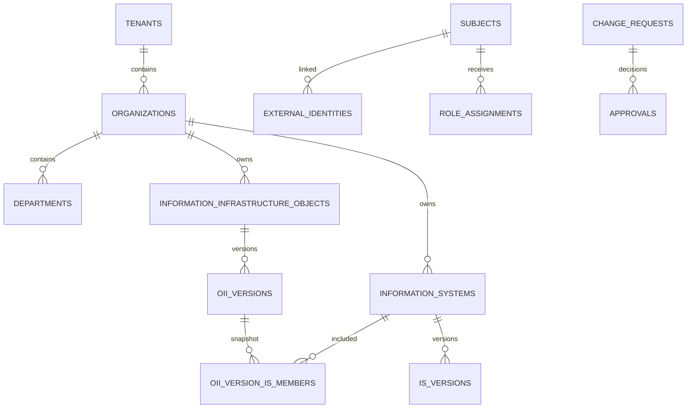

# AtlasIS Data Model v1

- Status: Proposed
- Version: 1.0-draft
- Date: 2026-10-09
- Related documents: ADR-011; Access Control Model v1
- Scope: conceptual relational model for review; not a migration or implementation specification

## 1. Purpose

This document proposes the initial relational model for the AtlasIS registry. It is intentionally pragmatic: explicit domain entities and foreign keys, tenant isolation enforced in the database as well as the application, immutable versions for controlled changes, and no universal metamodel or generic entity-attribute-value design.

The model reflects the following domain decisions:

- An Information System (IS) and an Object of Information Infrastructure (OII) are distinct domain entities with independent identities, attributes, owners, lifecycle and regulatory facts.
- An OII may include one or several ISs. In v1, individually managed non-IS technical assets are out of scope.
- An IS may belong to more than one OII.
- Nested OIIs are not supported in v1.
- A relationship between an OII and an IS does not transfer ownership, responsibility, access rights, regulatory status or other attributes.
- “Create based on” is a controlled copy operation in the application. It creates a new independent record; it does not create inheritance or ongoing synchronization.

This is a proposed target model. It does not assert that the current Go domain types or PostgreSQL migrations already conform.

## 2. Modeling principles

1. **Separate identity from similarity.** Two records remain distinct even when their names, owners or attributes initially match.
2. **No implicit inheritance.** Ownership, department, contacts, risk, attestation, protection status and lifecycle belong to the specific IS or OII record.
3. **Use real relational constraints.** Relationships use UUID foreign keys; do not store related IDs in arrays/JSONB or use `object_type + object_id` where a real foreign key can be used.
4. **Keep tenant boundaries explicit.** Tenant ownership must be checked by composite foreign keys and tenant-aware queries, not only by Go code.
5. **Version controlled state.** Approved changes create immutable versions; drafts and discussions are not versions of the effective state.
6. **Reuse mechanisms, not business semantics.** Common audit, numbering, authorization and workflow infrastructure may be shared without forcing IS and OII into one domain table.
7. **Avoid premature abstraction.** Do not create a universal entity framework, EAV schema or a large JSONB document as the primary store for core fields.

## 3. Conceptual ER model

The diagram is logical, not a complete schema. Organization ownership and department ownership are independent references on each IS/OII record. The owning department, if present, must belong to the selected owning organization.

## 4. Core entities

### 4.1 Tenant

Represents the top-level data-isolation boundary.

Suggested fields:
- `id UUID PRIMARY KEY` (UUIDv7 generated by the application or a trusted database function);
- `display_name`;
- `status`;
- `created_at timestamptz`;
- `updated_at timestamptz`.

Tenant identifiers must not be inferred from organization names or user input. Tenant deletion should normally be prohibited once business records exist; use a lifecycle status instead.

### 4.2 Organization

An independently managed organization in exactly one tenant.

Suggested fields:
- `id UUID PRIMARY KEY`;
- `tenant_id UUID NOT NULL`;
- `display_number`;
- `name`, optional legal name and other approved directory attributes;
- `status`;
- timestamps.

Constraints:
- `UNIQUE (tenant_id, id)` to support composite tenant-aware foreign keys;
- `UNIQUE (tenant_id, display_number)`;
- required fields are `NOT NULL`.

Organization-to-organization relationships belong in a normalized relation table, e.g. `organization_relationships(tenant_id, source_organization_id, target_organization_id, relationship_type, valid_from, valid_until)`. Both endpoints must belong to the same tenant. Define allowed relationship types and duplicate/cycle rules explicitly. A relationship does not imply access or ownership inheritance.

### 4.3 Department

A department belongs to exactly one organization and tenant. It is separate from an organization because an organization may have many departments, and the same department name can occur in multiple organizations.

Suggested fields: `id`, `tenant_id`, `organization_id`, `display_number` or stable code, `name`, `status`, timestamps.

Constraints:
- `UNIQUE (tenant_id, organization_id, id)`;
- a composite foreign key to `organizations(tenant_id, id)`;
- uniqueness for department code/number within the organization, if such a number is required.

Do not store a free-text department name on IS/OII as the authoritative owner when a department record exists. A display label may be derived for presentation.

### 4.4 Information System

A first-class domain entity with independent identity, ownership and lifecycle.

Suggested fields:
- `id UUID PRIMARY KEY`;
- `tenant_id UUID NOT NULL`;
- `display_number`;
- `name`, `description`, `purpose`;
- `organization_owner_id UUID NOT NULL`;
- `department_owner_id UUID NULL`;
- `lifecycle_status`;
- timestamps and actor references as required.

Use separate related tables for stable structured IS-specific attributes when their cardinality warrants it. Do not put every possible IS property into one table or use JSONB for core fields that need validation, joins, filtering or reporting.

Normative/GRC attribute groups to be modeled explicitly during detailed design (not yet a column-level schema):
- information processed and the applicability basis for Order No. 66;
- the applicable IS type/classification required by the relevant regulatory process, including the source, decision date and supporting evidence;
- information-protection-system applicability and status, kept separate from evidence that the system is attested;
- attestation status and attestation evidence metadata (number, issue date, validity/review date, issuing body and document reference, where applicable);
- risk/criticality assessment as an internal GRC assessment with methodology/version, assessment date, assessor, rationale and review date; do not use it as a proxy for formal CII designation.

For each group, distinguish “not applicable”, “required but not completed”, “in progress”, “completed/current”, “expired/overdue” and “unknown” only where these states are meaningful. The final enumerations and mandatory conditions require review against the applicable normative clause and internal procedure.

The owning organization and department are independent of any OII that contains the IS. The department must belong to the same tenant and the selected owning organization. Reassignment of ownership is an audited change and does not change the IS's technical identity.

### 4.5 Object of Information Infrastructure (OII)

A first-class domain entity with independent identity, ownership, lifecycle and regulatory attributes.

Suggested fields:
- `id UUID PRIMARY KEY`;
- `tenant_id UUID NOT NULL`;
- `display_number`;
- `name`, `description`, `purpose`;
- `organization_owner_id UUID NOT NULL`;
- `department_owner_id UUID NULL`;
- `lifecycle_status`;
- timestamps and actor references as required.

OII-specific attributes should be modeled as explicit columns or related tables according to their lifecycle and cardinality. Candidate groups include:
- applicability of the Order No. 130 requirements and the responsible applicability rationale;
- structural and logical diagram/document references, with version, owner, approval/review date and freshness status;
- status of key cybersecurity controls (access control, privileged access, patching, time synchronization, perimeter protection/IDS/IPS where applicable, event collection/retention and malware protection), with last verification date, responsible party, exceptions and evidence reference;
- cybersecurity-center service/contract applicability, provider/center reference, effective dates, responsible contacts, object-specific regulation and response-plan references where that service model applies;
- any formal regulatory designation, such as a possible CII designation, only after the legal relationship to the OII record has been established. Store the decision/source metadata and evidence separately. Until that legal mapping is confirmed, do not assume that a CII designation has a direct foreign-key relationship to an OII, and never infer CII status from internal criticality or merely from the fact that a record is an OII.

These are candidate attribute groups, not a statement that every field is universally mandatory or must be stored directly in AtlasIS. The matrix determines applicability and whether AtlasIS stores the fact, evidence metadata or a protected external reference. Do not copy any of these facts from a member IS as authoritative facts.

The OII owner may be different from every member IS owner. Ownership is not derived from the OII composition.

### 4.6 Individually managed non-IS assets (deferred)

Individually managed non-IS technical/information assets are out of scope for v1. The v1 OII composition
model links OIIs to ISs only. Do not add a technical-assets catalogue, TA numbering or OII-to-technical-
asset links in the initial implementation. If the business later requires these records, reopen the
scope through a separate design decision and add typed tables with real foreign keys rather than a
polymorphic member_type/member_id relationship.

### 4.7 Subject and external identity

AtlasIS needs an internal subject record separate from identity-provider and directory attributes.

Suggested conceptual entities:
- subjects: internal UUID primary key, lifecycle/status, created/updated timestamps;
- external_identities: internal UUID, subject_id FK, issuer/source namespace, external subject identifier,
  optional directory identifier such as sAMAccountName, linked_at, link_status and audit metadata;
  enforce uniqueness for the issuer/source namespace plus external subject identifier;
- subject_tenant_memberships: subject_id, tenant_id, status, validity period and audit metadata;
- subject_organization_memberships: subject_id, tenant_id, organization_id, status, validity period
  and audit metadata, if organization membership is needed for authorization;
- role_assignments: subject_id, tenant_id, role, scope type/id, granted_by, justification, status,
  validity window and audit metadata.

These are conceptual names, not a finalized DDL schema. Use UUIDs and real foreign keys; enforce tenant
consistency on memberships and assignments. The external identity key should normally be the validated
OIDC issuer/subject pair (iss, sub). Store sAMAccountName as a namespaced attribute/lookup key, not as
the immutable internal subject ID. If it is used for lookup, its uniqueness constraint must include the
AD/source namespace; never impose global uniqueness on the bare account name. Do not assume
sAMAccountName, email, UPN, domain or display name is globally unique or immutable.

For v1, Keycloak provides verified OIDC claims and corporate Active Directory is the initial authoritative
directory for user profile attributes. AtlasIS must allow an administrator or delegated access
administrator to assign roles to a subject after the subject has authenticated at least once. Successful
OIDC authentication does not automatically grant business permissions. Changes to email, domain,
display name or organization must not silently create a new subject or grant/revoke roles. If a person
moves between organizations while the external identity remains the same, retain the internal subject
and explicitly review organization memberships and scoped role assignments.

The mapping must support a future corporate identity service/API and controlled, audited linking of a
new external identity to an existing internal subject. The exact stable AD claim and account-linking
procedure must be finalized before implementing the identity adapter.

## 5. OII composition

The authoritative membership relation for v1 is `oii_version_information_systems(tenant_id, oii_version_id, information_system_id, ...)`, with real foreign keys to the OII version and IS. Each row records membership in a specific immutable OII version; the same IS may appear in multiple OII versions and in more than one OII.

Constraints and behavior:
- enforce unique membership for a given OII version/IS pair;
- nested OIIs are not supported in v1, so no OII-to-OII membership path exists;
- do not automatically inherit ownership, access assignments, contacts, classifications or statuses across the link;
- add/remove membership through the controlled Change Request workflow where the change is regulated or otherwise material;
- preserve membership history through immutable OII versions and identify the actor/Change Request that changed the composition.

The effective current composition is the membership of the current OII version. Do not maintain a separately editable membership list that can drift from the approved version. If query performance later requires a current-membership projection, derive and update it transactionally from the versioned source of truth. Avoid storing an array of IS UUIDs on the OII row and avoid polymorphic member_type/member_id references.

### Composition versioning

Because the composition of an OII may be a material part of its regulated state, represent the approved composition in versioned form. Proposed structure:
- `information_infrastructure_object_versions`: immutable snapshots of the OII's effective attributes, unique on `(oii_id, version_number)`;
- `oii_version_information_systems`: IS membership for a specific OII version;

A version's membership rows are immutable after the version is applied. The current composition is the membership of the current OII version, not a separately editable list that can drift away from the approved snapshot. Draft composition belongs to the Change Request until application.

IS versions use `information_system_versions`, unique on `(information_system_id, version_number)`. Do not create a new effective version for every draft keystroke; create it when an approved change is applied.

## 6. Change Requests, approvals and discussion

### Change Requests

A Change Request is a workflow aggregate that proposes changes to one target resource. It needs its own UUID, display number, tenant, initiator, status, timestamps, submitted/applied metadata and audit trail.

Avoid an unconstrained `target_type + target_id` as the only reference. For the initial set of two target types, prefer either:
- explicit nullable target FKs with a CHECK constraint requiring exactly one target; or
- separate typed child tables if workflow differences become substantial.

The target must be one of: an IS or an OII for v1. A Change Request for a composition change targets the OII because it changes the OII's effective composition. When applied, it references the source and resulting version IDs as applicable.

The existing architecture's principle remains: controlled changes are proposed through Change Requests and produce immutable effective versions.

### Approvals

Approval records belong to one Change Request and retain the assigned approver, decision, rationale, timestamps and any required policy context. Enforce valid decision values and foreign keys. If the workflow needs repeated decisions, reassignment, revocation or delegation history, model immutable approval-decision events separately from the current assignment; do not overwrite historical decisions.

### Discussions and comments

Threads and comments must reference their parent with relational integrity. Avoid unconstrained polymorphic `resource_type + resource_id` references unless there is a strong, documented reason and compensating integrity checks. For the limited v1 resource set, use explicit parent FKs or typed thread tables. Discussion history is separate from the immutable business version and must not silently mutate it.

## 7. Ownership and responsibility

For each IS and OII in v1, store ownership explicitly. If individually managed non-IS assets are added in a future version, apply the same ownership principles:
- owning organization is required;
- owning department is optional unless business/regulatory rules require it;
- department, when set, must belong to the same organization and tenant;
- responsible people/teams should be represented through explicit responsibility/assignment records if multiple people, roles, validity periods or history are required.

Do not infer the OII's owner from member ISs. Do not infer an IS's owner from the OII. Organization relationships and OII composition are descriptive relationships, not access grants.

The meaning of “owner” should be defined separately from technical administrator, information-security contact, business owner and Change Executor. Avoid overloading a single owner field with these distinct responsibilities.

## 8. Tenant integrity and PostgreSQL constraints

Application filters are necessary but not sufficient. Use composite foreign keys to prevent cross-tenant references even when application code is faulty.

For example, where `organizations` has `UNIQUE (tenant_id, id)`, an IS can use:
- `FOREIGN KEY (tenant_id, organization_owner_id) REFERENCES organizations(tenant_id, id)`;
- a tenant-aware department reference that also ensures the department belongs to the selected owner organization. This can use a composite key including `tenant_id, organization_id, id`.

Repeat the same pattern for OII, IS/OII composition links, Change Requests, identity mappings and workflow records. Individually managed non-IS technical assets are deferred from v1. Child records should carry `tenant_id` where it materially supports isolation and indexes, but constraints must guarantee it agrees with the parent. Do not rely on duplicated tenant IDs without composite FKs.

Baseline database practices:
- UUIDv7 primary keys with real foreign keys;
- `NOT NULL`, `UNIQUE`, `CHECK` constraints for stable invariants;
- `timestamptz` for instants;
- indexes on child foreign-key columns and actual list/filter access paths;
- optimistic concurrency/version checks for concurrent edits where needed;
- soft archive/status for business records that must remain auditable;
- append-only audit events for security-significant actions;
- PostgreSQL Row-Level Security may be considered as defense in depth, not a replacement for explicit tenant-aware repository methods and tests.

Use JSONB only for genuinely flexible, non-core metadata. Do not use JSONB or arrays to evade relational modeling for ownership, composition, approvals or identifiers.

## 9. Identifiers and display numbers

Technical identifiers are UUIDv7 and are used for all database relationships and API resource identity.

The earlier generic `IA00001` display-number rule assumed that IS and OII were one domain entity. For v1 it is superseded by separate IS and OII number namespaces. Agreed initial scheme:
- `ORG00001`: organization, counter scoped to tenant;
- `DEPT00001`: department, counter scoped to organization;
- `IS00001`: information system, counter scoped to tenant;
- `OII00001`: object of information infrastructure, counter scoped to tenant;
- `CR00001`: Change Request, counter scoped to target resource;
- `APR00001`: approval, counter scoped to Change Request;
- `THR00001`: discussion thread, counter scoped to parent resource;
- `CMT00001`: comment, counter scoped to thread.

These prefixes and scopes are the agreed target for v1. Tenant-local, type-specific counters avoid collisions between distinct domain types and do not change when an owner organization changes. The legacy `IA` identifier remains a migration/reference value for existing records until a separately reviewed migration defines its conversion; it is not the target numbering scheme for newly created IS or OII records.

Counter allocation must be atomic and database-backed. Never use `COUNT(*) + 1` or an unlocked read-modify-write. Add uniqueness constraints for each declared scope and allow gaps after rollback; never reuse issued numbers. User-facing short numbers may be ambiguous without parent context; machine references always use UUIDs.

## 10. “Create based on” behavior

“Create IS based on IS” or “Create OII based on IS” is an application use case, not a database relationship or inheritance feature.

Expected behavior:
1. The caller must be authorized to read the source and create the target type.
2. The application copies only an explicit allowlist of fields that are meaningful for the target type.
3. Ownership, department, contacts, access assignments, regulatory/attestation results, approvals, history, versions and relationships are not blindly copied as authoritative facts. Ownership may be prefilled as a user-editable suggestion if the UI clearly requires confirmation.
4. A new target receives its own UUID, display number, audit event and initial version/lifecycle state.
5. The source record is not changed.
6. No composition link is created implicitly. The user explicitly confirms membership as a separate action or step.
7. After creation, source and target evolve independently; there is no synchronization.

The copy profile must be tested so fields omitted from the allowlist cannot accidentally leak into the new record.

## 11. Initial index and constraint guidance

Final indexes depend on real query patterns, but the initial design should include:
- primary keys on all entities;
- tenant-scoped unique constraints for display numbers;
- indexes for `(tenant_id, lifecycle_status)` and common owner/list filters where query evidence supports them;
- indexes on OII-version membership rows by version and IS, plus uniqueness of the version/IS pair;
- indexes on `change_requests(tenant_id, status, created_at)` and target references;
- indexes on version tables by parent and version number;
- indexes on approval records by Change Request and assigned approver;
- indexes on all FK columns used for parent-to-child lookup or deletion checks.

Do not add indexes to every field by default. Validate high-volume queries with `EXPLAIN (ANALYZE, BUFFERS)` against representative data before tuning.

## 12. Decisions resolved for v1 and remaining before DDL

The following product-level decisions are resolved for the v1 target model:

1. Individually managed non-IS technical assets are deferred. OII composition in v1 links OIIs to ISs only.
2. An IS may belong to multiple OIIs.
3. Nested OIIs are not supported in v1.
4. Each Change Request targets exactly one IS or one OII. A composition change targets the OII. Multi-resource atomic Change Requests are deferred; if a business operation eventually needs coordinated changes to both an IS and an OII, use separate Change Requests or design a higher-level coordinated workflow in a later decision.
5. Effective IS and OII business/regulatory state is versioned. OII version snapshots include the composition effective for that version. Operational metadata that does not define approved business/regulatory state may remain outside immutable versions, but its audit/lifecycle requirements must be explicit.
6. Display numbers use separate prefixes and counters scoped to tenant and entity type for IS and OII. CR numbers are scoped to their single target resource; approval numbers to the CR; discussion numbers to their declared parent.
7. Keycloak is the v1 OIDC provider. The initial directory source is corporate Active Directory; identity attributes are received from verified OIDC claims. AtlasIS keeps internal subject IDs, external identity mappings, role assignments and their history. A future corporate identity API must be supportable without changing internal subject identity or authorization semantics.

The following details remain for detailed design and do not block this conceptual model:
- the field-by-field classification of IS/OII attributes as versioned business/regulatory state versus operational metadata, including validation against OAC Orders No. 66 and No. 130;
- the precise stable AD identity attribute/claim mapping and account-linking procedure, including how Keycloak's issuer/subject pair is related to the AD account and how future identity-source changes are audited;
- the exact version-retention and audit-evidence requirements for OII membership removal;
- exact Change Request and discussion parent table layouts, indexes and constraint names.

No code or migration should be prepared until these details are reflected in the implementation design and reviewed.

## 13. Implementation reconciliation checklist

Before changing code or migrations:
1. Inventory actual Go domain entities and their invariants.
2. Inventory every PostgreSQL migration and current schema.
3. Compare current IS/OII/asset concepts, ownership fields, tenant IDs, version snapshots, Change Request targets and composition relationships against this proposal.
4. Record each gap as: keep, change, migrate, or defer.
5. Define data migration and rollback/backfill for existing records and display numbers.
6. Add tests for tenant-aware FKs, cross-tenant link rejection, ownership/department consistency, OII composition history, concurrent numbering and “create based on” copy rules.
7. Only then prepare DDL and Go changes in a separate reviewed change.

No code, database migration, API contract or runtime behavior is changed by this document.

## 14. Reconciliation against the current repository (2026-10-09)

This section records a first-pass review of the current Go domain and SQL migrations. It is based on `backend/migrations/0001_initial.sql` through `0005_approval_id_sequence.sql`, `backend/internal/domain/asset/*`, the asset/change application use cases and PostgreSQL repositories. It is not a claim that every repository or API path has been audited.

### 14.1 Current model observed

- `InformationAsset` is a shared Go domain type. Its `Type` is either `information_system` or `information_infrastructure_object`.
- The `information_assets` table is a root row containing the text primary key and `current_version`. The actual business attributes, including `type`, are stored in `information_asset_versions`.
- Both IS and OII therefore currently share one identity namespace, one version schema, one ownership schema and one security profile.
- The ID parser and SQL CHECK constraint require `IA[0-9]{5}`. The database uses a global sequence for IA numbers.
- A Change Request has one `asset_id` and one `base_version`; its controlled field changes are stored separately. Applying a Change Request creates the next immutable asset version and advances `current_version` inside a transaction. The applier locks the asset row and checks the expected base version.
- Approval records have a real FK to a Change Request. Approval state/timestamp consistency is constrained in PostgreSQL. Change Request and approval display numbers currently use global sequences.
- The schema uses TEXT identifiers as primary/foreign keys rather than UUID technical keys. The shown migrations do not define tenant, organization or department catalogue tables, and `organization_id`, `owner_id`, initiator and approver references are not protected by FKs to such catalogues in these migrations.
- The inspected migrations do not define an internal subject catalogue, OIDC external-identity mapping, tenant-aware role assignments or user profile synchronization. These are target-model requirements, not existing capabilities.
- The shown schema does not define OII-to-IS composition tables or an individually managed non-IS asset catalogue. The domain has discussion types, but no discussion persistence table appears in migrations 0001–0005.
- `change_request_changes.old_value` and `new_value` are JSONB objects. This is acceptable for typed before/after field values if the application validates their shape; it should not be extended to store ownership, composition or other relationships as JSON.
- `ON DELETE CASCADE` is used for Change Request child changes and approvals. This is convenient for disposable test data but should be reviewed against the requirement to preserve audit and workflow history; business Change Requests should normally be cancelled/archived rather than physically deleted.

### 14.2 Findings and proposed disposition

| Priority | Finding | Proposed disposition |
|---|---|---|
| P1 | IS/OII distinction is a value of `InformationAsset.Type`, not separate domain identities | Split the domain into IS and OII entities before adding composition. Keep shared validation/workflow infrastructure where it remains semantically correct. |
| P1 | No OII-to-IS composition relation exists in the shown schema | Add an explicit OII-to-IS membership relation and preserve effective composition in immutable OII-version snapshots. Non-IS composition is deferred from v1. |
| P1 | Organization and owner are unvalidated strings in the shown schema; department is absent | Introduce organization and department references and database constraints. Do not infer an OII owner from member ISs. |
| P1 | Tenant boundaries are absent from the shown migrations | Add tenant ownership and tenant-aware composite FKs as part of the approved multi-tenant foundation; do not implement tenant isolation only as application filters. |
| P1 | Display identifiers are the primary keys and are globally sequenced | Introduce UUID technical primary keys and keep display numbers as separately constrained business identifiers. This is a migration-impacting decision and must be designed before DDL changes. |
| P2 | IS-specific and OII-specific fields are stored in one version table | Separate IS and OII version snapshots where fields and validation semantics differ. Avoid a universal table with many nullable columns. |
| P2 | Change Request is hard-wired to the shared asset ID | For the two-target-type v1, use explicit nullable target FKs plus a CHECK requiring exactly one target, or typed child tables. Do not use only `target_type + target_id` without an enforceable FK. |
| P2 | Change Request numbering is global, while the proposed model scopes CR numbers to a target | Resolve numbering policy. If CRs are target-scoped, add a target-scoped atomic counter and uniqueness constraint; do not silently change existing identifiers. |
| P2 | Version snapshots contain a business type discriminator | After separating IS/OII, keep each version table constrained to its entity type or use typed version tables. |
| P2 | Child workflow records cascade on physical deletion | Decide and document retention/deletion rules; prefer soft lifecycle transitions and retained history for governed records. |
| P3 | Discussion domain types are not represented in the inspected migrations | Treat discussion persistence as not yet evidenced in this migration set; design real parent FKs when adding it. |
| Keep | Current version pointer uses a composite FK to the version table | Preserve the invariant that the current version must exist. Recreate it separately for IS and OII roots. |
| Keep | Change application checks base version and locks the root row in a transaction | Preserve optimistic version checks and atomic application when splitting entity repositories. |
| Keep | SQL checks constrain statuses, risk, criticality and security enums | Retain database constraints, splitting allowed values where IS/OII regulatory semantics differ. |

### 14.3 Migration approach (proposal, not execution)

Do not replace the current schema in one destructive migration. A safer staged migration is:

1. Freeze the target entity and identifier decisions before writing migrations.
2. Add UUID technical keys and tenant/organization/department catalogues with constraints, initially without dropping existing display IDs.
3. Map existing `IAxxxxx` rows to new UUIDs while preserving each existing display number as a legacy/reference value.
4. Split current version rows into IS and OII version tables according to the existing `type`; validate all versions and current-version pointers.
5. Add the approved OII-to-IS composition structures. Individually managed non-IS asset structures remain out of scope for v1. Do not fabricate composition links from matching names or owners.
6. Migrate Change Request targets and approval references through a verified old-to-new ID mapping; preserve workflow history and the association between a Change Request and the version it produced.
7. Add tenant-aware FKs and negative integration tests that prove cross-tenant references are rejected.
8. Switch application reads/writes, compare record counts and version histories, and only then consider removing legacy columns/keys in a later migration.

The exact sequence depends on whether the environment contains data that must be preserved. No data migration or code change is performed by this document.

### 14.4 Decisions to settle before implementation

1. Which exact IS/OII fields are immutable business/regulatory version state versus operational metadata, after checking OAC Orders No. 66 and No. 130?
2. How should the formal CII designation and its evidence be linked to AtlasIS records without treating CII as a synonym for OII? The source entity/reference and legal mapping must be confirmed before DDL.
3. Which verified Keycloak claims and AD attributes will map an external identity to an internal AtlasIS subject, and what controlled procedure will support identity-source changes?
4. What retention period and audit evidence are required for removed OII members?
5. What exact FK/table layouts will be used for Change Request targets, discussions and identity mappings?
