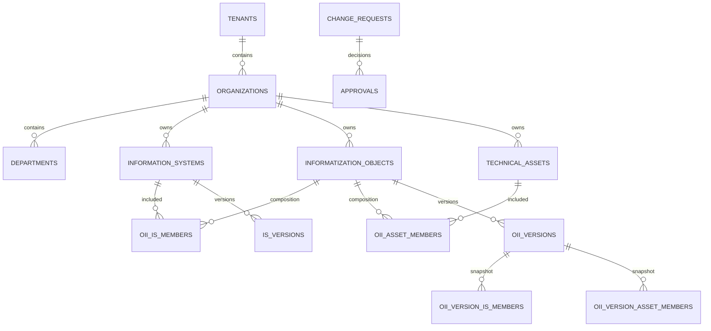

# AtlasIS Data Model v1

- Status: Proposed
- Version: 1.0-draft
- Date: 2026-10-09
- Related documents: ADR-011; Access Control Model v1
- Scope: conceptual relational model for review; not a migration or implementation specification

## 1. Purpose

This document proposes the initial relational model for the AtlasIS registry. It is intentionally pragmatic: explicit domain entities and foreign keys, tenant isolation enforced in the database as well as the application, immutable versions for controlled changes, and no universal metamodel or generic entity-attribute-value design.

The model reflects the following domain decision:

- An Information System (IS) and an Object of Informatization (OII) are distinct domain entities with independent identities, attributes, owners, lifecycle and regulatory facts.
- An OII may include one IS, several ISs, non-IS technical/information assets, or a combination.
- An IS may belong to more than one OII if the approved domain rules permit it.
- A relationship between an OII and an IS does not transfer ownership, responsibility, access rights, regulatory status or other attributes.
- “Create based on” is a controlled copy operation in the application. It creates a new independent record; it does not create inheritance or ongoing synchronization.

This is a proposed target model. It does not assert that the current Go domain types or PostgreSQL migrations already conform.

## 2. Modeling principles

1. **Separate identity from similarity.** Two records remain distinct even when their names, owners or attributes initially match.
2. **No implicit inheritance.** Ownership, department, contacts, risk, attestation, protection status and lifecycle belong to the specific IS or OII record.
3. **Use real relational constraints.** Relationships use UUID foreign keys; do not store related IDs in arrays/JSONB or use `object_type + object_id` where a real foreign key can be used.
4. **Keep tenant boundaries explicit.** Tenant ownership must be checked by composite foreign keys and tenant-aware queries, not only by Go code.
5. **Version controlled state.** Approved changes create immutable versions; drafts and discussions are not versions of the effective state.
6. **Reuse mechanisms, not business semantics.** Common audit, numbering, authorization and workflow infrastructure may be shared without forcing IS and OII into one domain table.
7. **Avoid premature abstraction.** Do not create a universal entity framework, EAV schema or a large JSONB document as the primary store for core fields.

## 3. Conceptual ER model

The diagram is logical, not a complete schema. Organization ownership and department ownership are independent references on each IS/OII/technical-asset record. The owning department, if present, must belong to the selected owning organization.

## 4. Core entities

### 4.1 Tenant

Represents the top-level data-isolation boundary.

Suggested fields:
- `id UUID PRIMARY KEY` (UUIDv7 generated by the application or a trusted database function);
- `display_name`;
- `status`;
- `created_at timestamptz`;
- `updated_at timestamptz`.

Tenant identifiers must not be inferred from organization names or user input. Tenant deletion should normally be prohibited once business records exist; use a lifecycle status instead.

### 4.2 Organization

An independently managed organization in exactly one tenant.

Suggested fields:
- `id UUID PRIMARY KEY`;
- `tenant_id UUID NOT NULL`;
- `display_number`;
- `name`, optional legal name and other approved directory attributes;
- `status`;
- timestamps.

Constraints:
- `UNIQUE (tenant_id, id)` to support composite tenant-aware foreign keys;
- `UNIQUE (tenant_id, display_number)`;
- required fields are `NOT NULL`.

Organization-to-organization relationships belong in a normalized relation table, e.g. `organization_relationships(tenant_id, source_organization_id, target_organization_id, relationship_type, valid_from, valid_until)`. Both endpoints must belong to the same tenant. Define allowed relationship types and duplicate/cycle rules explicitly. A relationship does not imply access or ownership inheritance.

### 4.3 Department

A department belongs to exactly one organization and tenant. It is separate from an organization because an organization may have many departments, and the same department name can occur in multiple organizations.

Suggested fields: `id`, `tenant_id`, `organization_id`, `display_number` or stable code, `name`, `status`, timestamps.

Constraints:
- `UNIQUE (tenant_id, organization_id, id)`;
- a composite foreign key to `organizations(tenant_id, id)`;
- uniqueness for department code/number within the organization, if such a number is required.

Do not store a free-text department name on IS/OII as the authoritative owner when a department record exists. A display label may be derived for presentation.

### 4.4 Information System

A first-class domain entity with independent identity, ownership and lifecycle.

Suggested fields:
- `id UUID PRIMARY KEY`;
- `tenant_id UUID NOT NULL`;
- `display_number`;
- `name`, `description`, `purpose`;
- `organization_owner_id UUID NOT NULL`;
- `department_owner_id UUID NULL`;
- `lifecycle_status`;
- timestamps and actor references as required.

Use separate related tables for stable structured IS-specific attributes when their cardinality warrants it. Do not put every possible IS property into one table or use JSONB for core fields that need validation, joins, filtering or reporting.

The owning organization and department are independent of any OII that contains the IS. The department must belong to the same tenant and the selected owning organization. Reassignment of ownership is an audited change and does not change the IS's technical identity.

### 4.5 Object of Informatization (OII)

A first-class domain entity with independent identity, ownership, lifecycle and regulatory attributes.

Suggested fields:
- `id UUID PRIMARY KEY`;
- `tenant_id UUID NOT NULL`;
- `display_number`;
- `name`, `description`, `purpose`;
- `organization_owner_id UUID NOT NULL`;
- `department_owner_id UUID NULL`;
- `lifecycle_status`;
- timestamps and actor references as required.

OII-specific attributes (e.g. regulatory classifications, protection-system status, attestation details or assessment results) should be modeled as explicit columns or related tables according to their lifecycle and cardinality. Do not copy these from a member IS as authoritative facts.

The OII owner may be different from every member IS owner. Ownership is not derived from the OII composition.

### 4.6 Technical/information asset that is not an IS

An OII may contain assets that are not themselves an information system. If those items must be individually inventoried, identified, owned, versioned or referenced, create a separate `technical_assets` entity rather than inventing an IS record or storing a name-only JSON entry.

Suggested fields:
- `id UUID PRIMARY KEY`;
- `tenant_id UUID NOT NULL`;
- `display_number`;
- `name`, `description`, `asset_type`;
- `organization_owner_id UUID NOT NULL`;
- optional `department_owner_id UUID NULL`;
- `lifecycle_status`;
- timestamps.

Keep this entity intentionally small in v1. Only add technical asset classes and specialized tables when the registry's agreed scope requires them. If non-IS items are not individually managed in the initial release, the detailed technical-asset catalogue can be deferred, but the decision must be explicit; do not use a polymorphic FK as a shortcut.

## 5. OII composition

Use explicit link tables with real foreign keys:

- `oii_information_systems(tenant_id, oii_id, information_system_id, ...)`;
- `oii_technical_assets(tenant_id, oii_id, technical_asset_id, ...)`.

The first link table connects OIIs to ISs; the second connects OIIs to non-IS technical assets. Both endpoint records must belong to the same tenant. The same IS may be linked to multiple OIIs unless a separately approved domain rule restricts it.

Constraints and behavior:
- unique active membership for a given OII/member pair;
- reject direct self-membership if OII nesting is ever introduced;
- do not automatically inherit ownership, access assignments, contacts, classifications or statuses across the link;
- add/remove membership through the controlled Change Request workflow where the change is regulated or otherwise material;
- preserve membership history and identify the actor/change request that changed the composition.

Avoid storing an array of IS UUIDs or asset UUIDs on the OII row. Avoid a single `member_type + member_id` polymorphic table for the v1 relational model because PostgreSQL cannot enforce a conventional foreign key to multiple target tables.

### Composition versioning

Because the composition of an OII may be a material part of its regulated state, represent the approved composition in versioned form. Proposed structure:
- `informatization_object_versions`: immutable snapshots of the OII's effective attributes, unique on `(oii_id, version_number)`;
- `oii_version_information_systems`: IS membership for a specific OII version;
- `oii_version_technical_assets`: non-IS asset membership for a specific OII version.

A version's membership rows are immutable after the version is applied. The current composition is the membership of the current OII version, not a separately editable list that can drift away from the approved snapshot. Draft composition belongs to the Change Request until application.

IS versions use `information_system_versions`, unique on `(information_system_id, version_number)`. Do not create a new effective version for every draft keystroke; create it when an approved change is applied.

## 6. Change Requests, approvals and discussion

### Change Requests

A Change Request is a workflow aggregate that proposes changes to one target resource. It needs its own UUID, display number, tenant, initiator, status, timestamps, submitted/applied metadata and audit trail.

Avoid an unconstrained `target_type + target_id` as the only reference. For the initial set of two target types, prefer either:
- explicit nullable target FKs with a CHECK constraint requiring exactly one target; or
- separate typed child tables if workflow differences become substantial.

The target must be one of: an IS or an OII for v1. A Change Request for a composition change targets the OII because it changes the OII's effective composition. When applied, it references the source and resulting version IDs as applicable.

The existing architecture's principle remains: controlled changes are proposed through Change Requests and produce immutable effective versions.

### Approvals

Approval records belong to one Change Request and retain the assigned approver, decision, rationale, timestamps and any required policy context. Enforce valid decision values and foreign keys. If the workflow needs repeated decisions, reassignment, revocation or delegation history, model immutable approval-decision events separately from the current assignment; do not overwrite historical decisions.

### Discussions and comments

Threads and comments must reference their parent with relational integrity. Avoid unconstrained polymorphic `resource_type + resource_id` references unless there is a strong, documented reason and compensating integrity checks. For the limited v1 resource set, use explicit parent FKs or typed thread tables. Discussion history is separate from the immutable business version and must not silently mutate it.

## 7. Ownership and responsibility

For each IS, OII and individually managed technical asset, store ownership explicitly:
- owning organization is required;
- owning department is optional unless business/regulatory rules require it;
- department, when set, must belong to the same organization and tenant;
- responsible people/teams should be represented through explicit responsibility/assignment records if multiple people, roles, validity periods or history are required.

Do not infer the OII's owner from member ISs. Do not infer an IS's owner from the OII. Organization relationships and OII composition are descriptive relationships, not access grants.

The meaning of “owner” should be defined separately from technical administrator, information-security contact, business owner and Change Executor. Avoid overloading a single owner field with these distinct responsibilities.

## 8. Tenant integrity and PostgreSQL constraints

Application filters are necessary but not sufficient. Use composite foreign keys to prevent cross-tenant references even when application code is faulty.

For example, where `organizations` has `UNIQUE (tenant_id, id)`, an IS can use:
- `FOREIGN KEY (tenant_id, organization_owner_id) REFERENCES organizations(tenant_id, id)`;
- a tenant-aware department reference that also ensures the department belongs to the selected owner organization. This can use a composite key including `tenant_id, organization_id, id`.

Repeat the same pattern for OII, technical assets, composition links, Change Requests and workflow records. Child records should carry `tenant_id` where it materially supports isolation and indexes, but constraints must guarantee it agrees with the parent. Do not rely on duplicated tenant IDs without composite FKs.

Baseline database practices:
- UUIDv7 primary keys with real foreign keys;
- `NOT NULL`, `UNIQUE`, `CHECK` constraints for stable invariants;
- `timestamptz` for instants;
- indexes on child foreign-key columns and actual list/filter access paths;
- optimistic concurrency/version checks for concurrent edits where needed;
- soft archive/status for business records that must remain auditable;
- append-only audit events for security-significant actions;
- PostgreSQL Row-Level Security may be considered as defense in depth, not a replacement for explicit tenant-aware repository methods and tests.

Use JSONB only for genuinely flexible, non-core metadata. Do not use JSONB or arrays to evade relational modeling for ownership, composition, approvals or identifiers.

## 9. Identifiers and display numbers

Technical identifiers are UUIDv7 and are used for all database relationships and API resource identity.

The earlier generic `IA00001` display-number rule assumed that IS and OII were one domain entity. With separate IS and OII entities, that rule needs to be revisited before implementation. Proposed initial scheme:
- `ORG00001`: organization, counter scoped to tenant;
- `DEPT00001`: department, counter scoped to organization;
- `IS00001`: information system, counter scoped to tenant;
- `OII00001`: object of informatization, counter scoped to tenant;
- `TA00001`: individually managed non-IS technical asset, counter scoped to tenant;
- `CR00001`: Change Request, counter scoped to target resource;
- `APR00001`: approval, counter scoped to Change Request;
- `THR00001`: discussion thread, counter scoped to parent resource;
- `CMT00001`: comment, counter scoped to thread.

These prefixes and scopes are a proposal, not yet a ratified change to ADR-011. Tenant-local, type-specific counters avoid collisions between distinct domain types and do not change when an owner organization changes. If the business requires numbering within an organization instead, preserve the original numbering scope explicitly (e.g. immutable numbering organization) rather than allowing a display number's namespace to change when ownership changes.

Counter allocation must be atomic and database-backed. Never use `COUNT(*) + 1` or an unlocked read-modify-write. Add uniqueness constraints for each declared scope and allow gaps after rollback; never reuse issued numbers. User-facing short numbers may be ambiguous without parent context; machine references always use UUIDs.

## 10. “Create based on” behavior

“Create IS based on IS” or “Create OII based on IS” is an application use case, not a database relationship or inheritance feature.

Expected behavior:
1. The caller must be authorized to read the source and create the target type.
2. The application copies only an explicit allowlist of fields that are meaningful for the target type.
3. Ownership, department, contacts, access assignments, regulatory/attestation results, approvals, history, versions and relationships are not blindly copied as authoritative facts. Ownership may be prefilled as a user-editable suggestion if the UI clearly requires confirmation.
4. A new target receives its own UUID, display number, audit event and initial version/lifecycle state.
5. The source record is not changed.
6. No composition link is created implicitly. The user explicitly confirms membership as a separate action or step.
7. After creation, source and target evolve independently; there is no synchronization.

The copy profile must be tested so fields omitted from the allowlist cannot accidentally leak into the new record.

## 11. Initial index and constraint guidance

Final indexes depend on real query patterns, but the initial design should include:
- primary keys on all entities;
- tenant-scoped unique constraints for display numbers;
- indexes for `(tenant_id, lifecycle_status)` and common owner/list filters where query evidence supports them;
- indexes on each composition link's OII and member FK, plus uniqueness of the pair;
- indexes on `change_requests(tenant_id, status, created_at)` and target references;
- indexes on version tables by parent and version number;
- indexes on approval records by Change Request and assigned approver;
- indexes on all FK columns used for parent-to-child lookup or deletion checks.

Do not add indexes to every field by default. Validate high-volume queries with `EXPLAIN (ANALYZE, BUFFERS)` against representative data before tuning.

## 12. Decisions required before DDL

The following points require explicit resolution:
1. Whether non-IS assets are individually registered in v1; if yes, define the minimum `technical_assets` taxonomy and fields.
2. Whether one IS may be included in multiple OIIs.
3. Whether nested OIIs are permitted. If not, do not model them in v1; if later allowed, define cycle detection and authorization semantics.
4. Which OII/IS fields are versioned and which are operational metadata.
5. Whether ownership and department changes require approval and whether historic values are kept in versions.
6. Final display-number prefixes/scopes, including whether to replace the earlier `IA` numbering rule.
7. Exact Change Request target schema and discussion-parent schema that preserve foreign-key integrity.
8. Required audit fields and whether external delivery needs a transactional outbox.
9. The regulatory source and exact rules for each OII classification, attestation or protection attribute. The database model must not invent legal equivalence.

## 13. Implementation reconciliation checklist

Before changing code or migrations:
1. Inventory actual Go domain entities and their invariants.
2. Inventory every PostgreSQL migration and current schema.
3. Compare current IS/OII/asset concepts, ownership fields, tenant IDs, version snapshots, Change Request targets and composition relationships against this proposal.
4. Record each gap as: keep, change, migrate, or defer.
5. Define data migration and rollback/backfill for existing records and display numbers.
6. Add tests for tenant-aware FKs, cross-tenant link rejection, ownership/department consistency, OII composition history, concurrent numbering and “create based on” copy rules.
7. Only then prepare DDL and Go changes in a separate reviewed change.

No code, database migration, API contract or runtime behavior is changed by this document.
